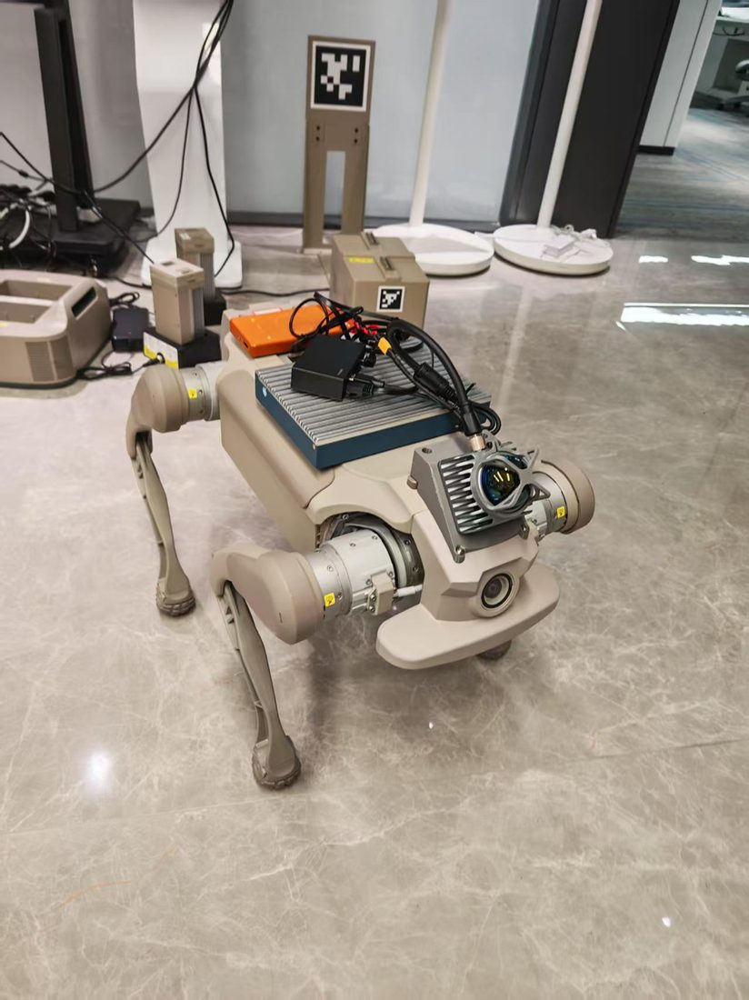

# 钢镚四足机器狗上位机（robot_ws）

智元 D1 Edu-Ultra + Livox Mid-360 + **Super-LIO** + Nav2 + Web 上位机。

## 效果展示

机器狗实物：



网页控制台（主控 WLAN 访问 http://192.168.122.152:8080）：


## 架构简述

- **底盘**：`genisom_bridge` → AgiBot HighLevel SDK（默认不发 odom TF；导航里程计由 `lio_tf_bridge` 转）
- **建图**：Livox → **Super-LIO**（`/lio/cloud_world`、`/lio/odom`）→ 前端体素累积预览 → 停止落盘 `map.pcd` → `pcd2pgm` → `maps/*.pgm`
- **导航定位**：
  - 里程计：`lio_tf_bridge`（默认 `odom_source:=dog`，站立零速航向锁）→ `/odom_nav` + `odom→base_footprint`
  - 激光：`nav_scan_node`（点云校平高度带 → `/scan`，外参含俯仰耦合）
  - 全局：AMCL + Nav2；手动「重定位」走 `auto_relocalize`（似然场搜图，非 ICP/NDT）
  - 可选全局 3D：`bbs3d_ros2`（BBS3D，脚本 `scripts/start_global_reloc.sh`）
- **上位机**：`web_ui/` 静态页 + rosbridge `:9090` + `web_ops_node.py` `:8090`

> 建图与导航互斥：建图时不要叠 `relocation_node` / 第二套 LIO；导航可与摇杆同开。

## 源码目录（重要依赖）

| 路径 | 说明 |
|------|------|
| `src/SUPER_LIO/` | Super-LIO 源码（**不提交** `super_lio/map/` 下多 GB 的 PCD 缓存） |
| `src/bbs3d_ros2/` | BBS3D ROS2 封装（git submodule，含上游 `3d_bbs`） |
| `src/livox_ros_driver2/` | Livox 驱动（本仓 `.gitignore`，需本机单独准备） |
| `src/lio_tf_bridge/` / `genisom_bridge/` / `nav2_tools/` / `auto_relocalize/` | 本仓维护 |
| `web_ui/` | 网页控制台 + `web_ops_node.py` |

克隆后若使用 submodule：

```bash
git clone --recurse-submodules https://github.com/shihua-hou/robot-dog-console.git
# 或已克隆：
git submodule update --init --recursive
```

## 一键启动

```bash
bash /home/linaro/robot_ws/start_ui_stack.sh
```

模式（`start_all.sh`）：

```bash
bash start_all.sh mapping        # 建图：Livox + Super-LIO + map_building
bash start_all.sh localization   # 导航传感：Livox + Super-LIO + lio_tf（dog odom）
```

### 开机自启（网页控制台）

重启后自动拉起静态页 `:8080`、`web_ops` `:8090`、`rosbridge` `:9090`（不自动开建图整链）：

```bash
sudo bash /home/linaro/robot_ws/scripts/install_web_console_service.sh
```

常用：

```bash
systemctl status dog-web-console
sudo systemctl restart dog-web-console
sudo systemctl disable dog-web-console   # 取消自启
```

浏览器请用主控 **WLAN（wlan0）** IP，不要用 eth0 / 交换机网段：

```text
http://192.168.122.152:8080/          # 示例：本机 wlan0
ws://192.168.122.152:9090             # rosbridge
```

`eth0` 上的 `192.168.1.x` / `192.168.168.x` 是给 Livox / 狗 SDK 用的。

界面交互：
- 首页驾驶舱入口；建图/导航全屏舞台
- **左摇杆 = 移动（vx/vy）**，**右摇杆 = 转向（wz）**
- 导航：先启动导航 →（建议）重定位至定位置信度 ≥60% → 设目标拖朝向
- 地图库：当前导航地图不可删；同名保存会覆盖并可选热加载

## 常用脚本

| 脚本 | 作用 |
|------|------|
| `start_all.sh mapping\|localization` | 传感 + Super-LIO +（建图时）map_building |
| `start_scan_node.sh` | Super-LIO 点云 → `/scan`（`nav_scan_node`） |
| `nav2_start.sh [map.yaml]` | 启动 Nav2 |
| `start_ui_stack.sh` | 以上 + rosbridge + web_ops + HTTP 8080 |
| `scripts/start_web_console.sh` | 仅网页三件套（8080/8090/9090） |
| `scripts/install_web_console_service.sh` | 安装 `dog-web-console` 开机自启 |
| `scripts/start_reloc.sh` / `start_global_reloc.sh` | 可选 relocation / BBS3D 全局重定位 |

## 上位机流程

1. **建图**：建图页 → 开始建图 → 遥控覆盖场地 → 看点云累积 → 停止 → 保存为 2D 地图  
2. **定位**：导航页选地图 → 启动导航 →「重定位」或设初始位姿 → 定位置信度尽量 ≥60%  
3. **导航**：设目标（含朝向）→ 行走；**急停**只停车/取消目标，**关闭导航**才卸 Nav2  

## 网络提示

- 狗端有线：`192.168.168.168`（SDK）/ 本机口常为 `192.168.168.150`
- Livox：见 `src/livox_ros_driver2/config/MID360s_config.json`
- 雷达外参：`config/lidar_extrinsic.yaml`（与 `nav_scan` / `lio_tf_bridge` 一致）
- 上位机浏览器访问板子局域网 IP（设置页可改）

## 编译

```bash
cd /home/linaro/robot_ws
source /opt/ros/humble/setup.bash
# 需已准备 livox_ros_driver2、Super-LIO 依赖（PCL 等）
colcon build --packages-select \
  basic super_lio genisom_bridge lio_tf_bridge nav2_tools auto_relocalize
# 可选全局重定位：
# colcon build --packages-select bbs3d_ros2
source install/setup.bash
```

## 上游致谢

- Super-LIO：本仓 `src/SUPER_LIO/`（运行时地图缓存在 `super_lio/map/`，不入库）
- BBS3D：`bbs3d_ros2` → https://github.com/abudori3939/bbs3d_ros2 （submodule `3d_bbs` → https://github.com/KOKIAOKI/3d_bbs.git）
- Livox ROS2 Driver、Nav2、AgiBot SDK 等
